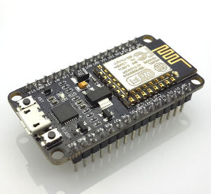
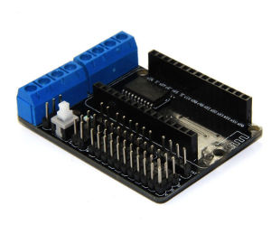
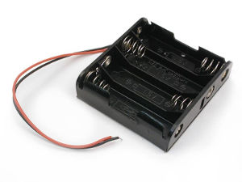
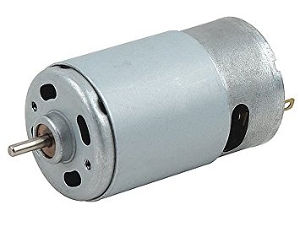

# To proper assemble the altBot this are the required parts

## Electronics

- NodeMCU ESP-12E Module - with CP2102 Serial chip

- NodeMCU motor Shield

- 4xAA Battery Case

- 2 Small DC Motors

## 3D-Printed/Cut Parts

- 2 Wheels
- 1 Frame

## Others

- Caster Wheel
- Zip ties
